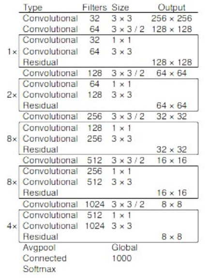

# Autonomous Driving Perception - Semantic Segmentation and Object Detection
This repository is for Computer Vision course project at George Washington University, The main purpose of this project is trying to complete Autonomous Driving Perception tasks to ensure safe driving condition.

## Team Member
* Zhangmingyang Su, Ze Gong, Derasari Preet


## Package Installation
* Tensorflow
* OpenCV
* yolov3.cfg
* coco.names
* yolov3.weights([Link](https://www.kaggle.com/valentynsichkar/yolo-coco-data?select=yolov3.cfg) because of the large file)

## Semantic Segmentation
### DeepLab Model Architecture


### Segmentation Result
After Implementing DeepLab model, The driving scene is segmented into 16 categories which represented by different colors in real-time.  
 


### Segmentation result based on different frame rates 
 

From the graph, it's easy to figure out the higher frame rate is, the better performance is. There are lots of things happen in a short-time, in order to ensure safe driving condition, we need to capture more information from frame to frame.  

### Segmentation result of original data vs temporal Data


For the temporal data, such as the transformation of the color, background, distortion, etc. All of these frames are not independent, so, we sum the current frame result and previous frame result to smooth the prediction. By using the temporal data, the performance is a little bit better than the original one without the temporal data.

## Object Detection
### YOLO-V3


### Object Detection Result


## Usage
1. Download dataset from Mit-DriveSeg.
2. Run ```object_detection.py``` to implement yolov3 model.
3. Run ```data_evaluate_segmentation.py``` to see performance change based on different frame rate(manually).
4. For orginal data vs temporal data analysis, Run ```data_evaluate_segmentation.py``` to see performance change in terms of Class IOU Metric.
5. More information, check [course paper](https://github.com/Zhangmingyang-Su/Autonomous-Driving-Perception/blob/main/pic/Perception%20Task%20-%20Semantic%20Segmentation%20and%20Object%20Detection%20in%20Autonomous%20Driving.pdf).
